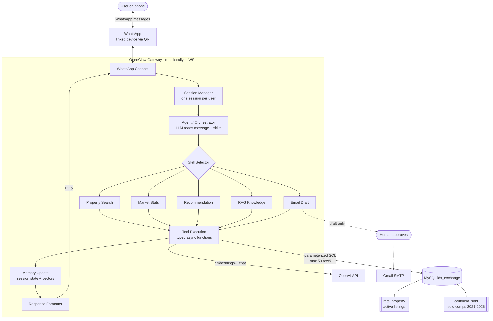

# IDX Multi-Agent Real Estate Assistant

Multi-agent AI assistant built on [OpenClaw](https://github.com/openclaw/openclaw) for IDX Exchange. It answers California real estate questions over WhatsApp using two real MLS tables: `rets_property` (active listings) and `california_sold` (sold comps 2021-2025).

Built by Riyan · IDX Exchange Agentic AI Engineering Intern, Fall 2026



## Progress

| Week | Module | Status | Deliverable |
|---|---|---|---|
| 0 | Environment Setup | In progress | [Setup guide](docs/WEEK0_SETUP.md), `scripts/verify_db.py`, `scripts/verify_keys.py` |
| 1 | Architecture Fundamentals | Done | [Architecture doc + workflow diagram](docs/ARCHITECTURE.md) |
| 2 | NL Property Search | | |
| 3 | Database Integration | | |
| 4 | Conversational Agent | | |
| 5 | Market Analytics | | |
| 6 | Embeddings & Vector Search | | |
| 7 | Recommendation Engine | | |
| 8 | RAG Pipeline | | |
| 9 | Multi-Agent Orchestration | | |
| 10 | WhatsApp Layer | | |
| 11 | Email Agents & Safety | | |
| 12 | Capstone Demo | | |

## Repo layout

```
docs/            setup guide, architecture doc, diagrams
scripts/         import + verification scripts
skills/          OpenClaw skills (copy into ~/.openclaw/workspace/skills/)
src/tools/       TypeScript tools the agent calls
sql/             DB/user setup (MLS dumps go in data/, which is gitignored)
```

## Quick start

See [docs/WEEK0_SETUP.md](docs/WEEK0_SETUP.md). Short version (WSL Ubuntu):

```bash
python3 -m venv venv && source venv/bin/activate
pip install -r requirements.txt
cp .env.example .env            # fill in keys
bash scripts/import_db.sh data/rets_property.sql data/california_sold.sql
python scripts/verify_db.py
python scripts/verify_keys.py
npm install -g openclaw@latest && openclaw onboard --install-daemon
openclaw channels login         # scan QR in WhatsApp > Linked Devices
```

## Safety

- Secrets live only in `.env` (gitignored). Never commit keys or MLS dumps.
- All SQL is parameterized, max 50 rows per query.
- Emails are draft-then-approve, never sent automatically.
