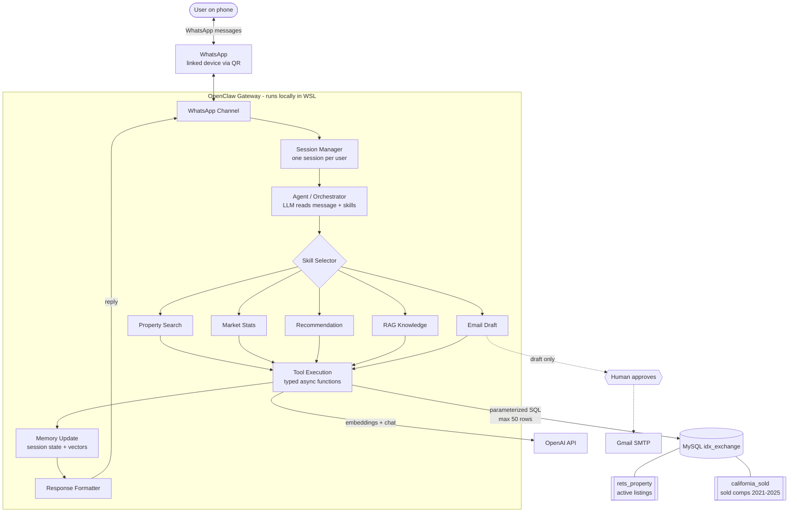
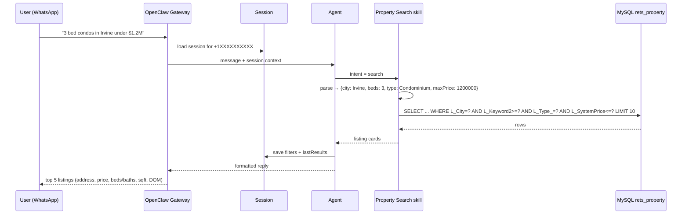

# Week 1: OpenClaw Architecture

**Deliverable:** architecture documentation with a workflow diagram showing how user queries flow from WhatsApp through OpenClaw skills to the MLS databases.

Author: Riyan · IDX Exchange Agentic AI Engineering Intern

---

## 1. The big picture

A user texts a question on WhatsApp. OpenClaw's gateway receives it, finds (or creates) that user's session, and hands the message to the agent. The agent reads the available skills, picks the one that fits, and calls that skill's tools. The tools run parameterized SQL against MySQL (`rets_property` for active listings, `california_sold` for sold comps) or call OpenAI for embeddings. Results go back to the agent, the session memory is updated, and a formatted reply goes back out over WhatsApp.

Handbook flow:

```
User → WhatsApp → OpenClaw Runtime → Skill Selector → Tool Execution → Memory Update → Response → User
```

## 2. Workflow diagram


Same diagram as Mermaid (GitHub renders this automatically):



## 3. Key components

| Component | What it is | In this project |
|---|---|---|
| **Gateway** | The local OpenClaw process (control plane) that owns channels, sessions, tools and events. Dashboard at `127.0.0.1:18789`. | Started by `openclaw onboard --install-daemon`, runs in WSL |
| **Channels** | Messaging interfaces the gateway connects to. | WhatsApp (QR-linked) now, email later in Week 11 |
| **Sessions** | Per-user conversation state, keyed by sender. | Stores search filters (city, budget, beds) and last results so follow-ups like "only ones with a pool" work (Week 4) |
| **Agent / Orchestrator** | The LLM loop that reads the message, decides intent, and routes to skills. | Classifies into search / market / recommend / knowledge / mixed (Week 9) |
| **Skills** | Modular capability units. Each is a folder with a `SKILL.md` that tells the agent when and how to use it. | Property search, market stats, recommendations, RAG, email draft |
| **Tools** | Typed async functions the agent can actually call. | `searchActiveListings()`, `getSoldComps()`, `getEmbedding()`, `draftEmail()` |
| **Memory** | Short-term session state plus long-term vector storage. | Session map for filters, embeddings of `L_Remarks` for semantic search (Week 6) |

## 4. How a single query flows (example)

User: *"Show me 3 bed condos in Irvine under $1.2M"*



## 5. Which skill hits which table

| Skill | Table(s) | Key columns |
|---|---|---|
| Property Search (Wk 2-4) | `rets_property` | `L_City`, `L_SystemPrice`, `L_Keyword2` (beds), `LM_Dec_3` (baths), `LM_Int2_3` (sqft), `L_Type_`, `PoolPrivateYN`, `ViewYN`, `L_Status` |
| Market Stats (Wk 5) | `california_sold` | `ClosePrice`, `CloseDate`, `LivingArea`, `DaysOnMarket`, `ListPrice`, `City`, `PropertyType` |
| Semantic Search (Wk 6) | `rets_property` | `L_Remarks` embeddings |
| Recommendation (Wk 7) | both | join `CAST(r.L_ListingID AS UNSIGNED) = cs.ListingKey`, or city + ZIP |
| RAG (Wk 8) | docs | Data Analyst Primer, Trestle metadata, schema table, Week 5 summaries |
| Email Draft (Wk 11) | both | draft-then-approve, never auto-send |

## 6. Safety rules baked into the design

- Secrets only in `.env`, never logged or committed.
- Every SQL call is parameterized (`?` placeholders), no string-built queries.
- Max 50 rows per query, no bulk exports of MLS data.
- Outbound actions (email) always stop at a draft and need a human "yes".
- WhatsApp DMs need pairing approval before the agent will talk to a new number.

## 7. Week 1 code

- `src/tools/basicTool.ts`: the handbook's `getCurrentTime` tool + simple message handler
- `src/tools/demo.ts`: runs it locally (`npm install && npm run week1:demo`)
- `skills/idx-hello/SKILL.md`: a first OpenClaw skill to prove the skill loading works. Copy it into `~/.openclaw/workspace/skills/` and ask the agent on WhatsApp "what time is it?" or "what can you do?"
